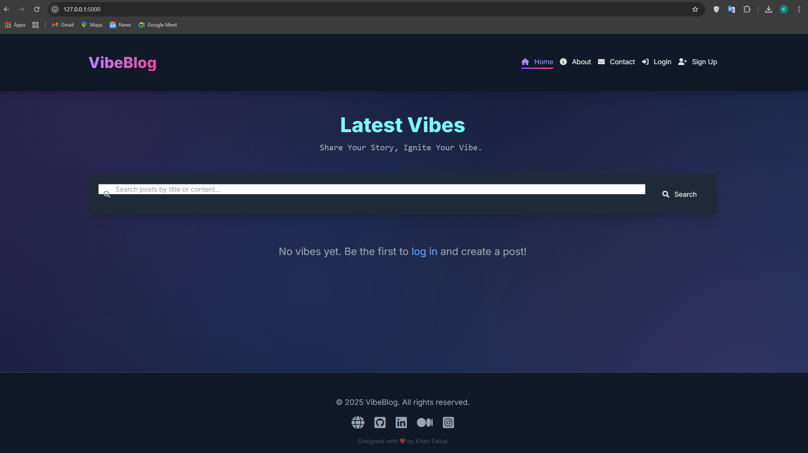
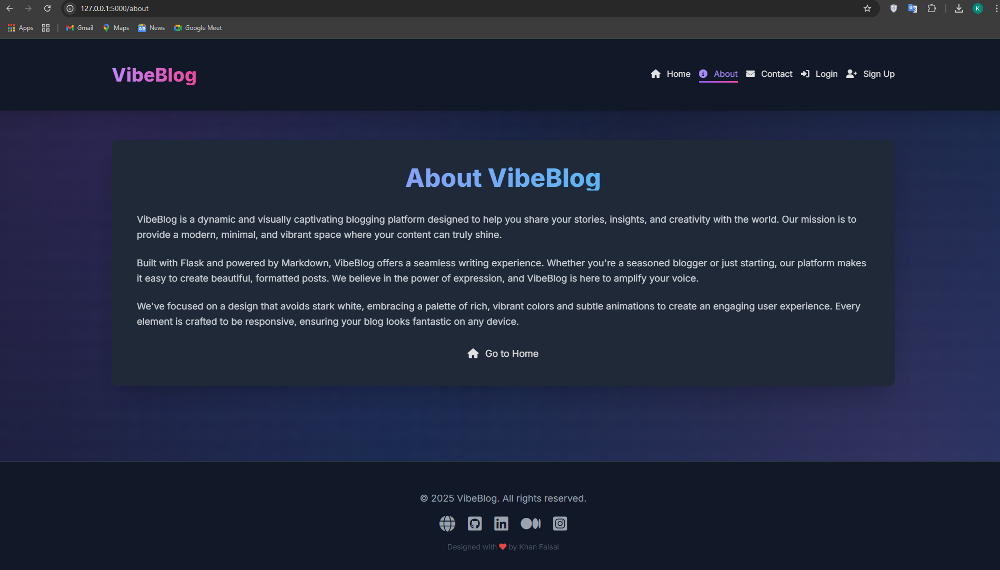

# VibeBlog 🌟

**VibeBlog** is a modern, responsive, and visually engaging blogging platform built with **Flask**, **Markdown**, and **Tailwind CSS**. Designed with a vibrant dark theme, subtle animations, and a clean UI, it offers both casual and authenticated users a seamless content creation and reading experience.

---

## 🚀 Live Demo

Experience VibeBlog live:  
👉 [VibeBlog Live Demo](https://vibe-blog-three.vercel.app)

---

## ✨ Features

- **🛡️ User Authentication**  
  Secure signup, login, and logout functionality.

- **🌐 Guest Browsing**  
  View all blog content without logging in.

- **✍️ Create, Edit & Delete Posts**  
  Authenticated users can manage their posts easily.

- **📑 Markdown Support**  
  Format blog content using Markdown syntax for headings, lists, code blocks, tables, etc.

- **🎨 Dynamic Content Formatting**  
  Beautifully styled and readable content with markdown-it rendering.

- **🔍 Search & Tag Filtering**  
  Find posts using keywords or filter by specific tags.

- **📱 Responsive Design**  
  Works seamlessly across desktops, tablets, and mobile devices.

- **🌈 Vibrant & Animated UI**  
  Dark theme with gradient colors and smooth animations.

- **⚡ Flash Messages**  
  Instant feedback for user actions (e.g., login success, post updates).

- **📎 Custom Footer**  
  Includes copyright and social media.

---

## 🛠️ Technologies Used

- **Backend:** Python (Flask)
- **Frontend:** HTML, Tailwind CSS
- **Content Rendering:** markdown-it
- **Authentication:** `werkzeug.security`, Flask sessions
- **Storage:** JSON files (demo purposes)
- **Dependencies:** pip & `requirements.txt`

---

## 📁 Project Structure

```
VibeBlog/
├── app.py
├── requirements.txt
├── posts.json
├── users.json
├── vercel.json
├── assets/
│   ├── screenshot_1.png
│   ├── screenshot_2.png
│   └── screenshot_3.png
├── static/
│   ├── css/
│   │   └── style.css
│   └── js/
│       └── script.js
└── templates/
    ├── base.html
    ├── index.html
    ├── login.html
    ├── signup.html
    ├── create_post.html
    ├── edit_post.html
    └── view_post.html
```

---

## 📸 Screenshots

  
*Homepage showcasing recent posts.*

  
*Detailed view of a single post with markdown formatting.*

  
*Interface for creating a new blog post.*

---

## 🧪 Installation & Setup

To run VibeBlog on your local machine:

1. **Clone the repository**

   ```bash
   git clone https://github.com/khanfaisal79960/VibeBlog.git
   cd VibeBlog
   ```

2. **Create and activate a virtual environment**

   ```bash
   # Windows
   python -m venv venv
   .\venv\Scripts\activate

   # macOS/Linux
   python3 -m venv venv
   source venv/bin/activate
   ```

3. **Install the dependencies**

   ```bash
   pip install -r requirements.txt
   ```

4. **Run the application**

   ```bash
   python app.py
   ```

5. **Visit in browser**

   ```
   http://127.0.0.1:5000/
   ```

---

## 📝 How to Use

- **Guest Browsing:** Visit homepage to view all posts.
- **Sign Up:** Click “Sign Up” in the navbar to register.
- **Login:** Use your credentials to access post creation.
- **Create Post:** After login, go to “Create Post”.
- **Edit/Delete Post:** Available on posts authored by you.
- **Search:** Use the search bar to find relevant posts.
- **Tags:** Click tags to filter blog content by category.

---

## 📞 Contact

Let’s connect:

- **🌐 Portfolio:** [khanfaisal.netlify.app](https://khanfaisal.netlify.app)
- **💻 GitHub:** [@khanfaisal79960](https://github.com/khanfaisal79960)
- **🔗 LinkedIn:** [@khanfaisal79960](https://www.linkedin.com/in/khanfaisal79960)
- **📝 Medium:** [@khanfaisal79960](https://medium.com/@khanfaisal79960)
- **📷 Instagram:** [@mr._perfect_1004](https://instagram.com/mr._perfect_1004)
